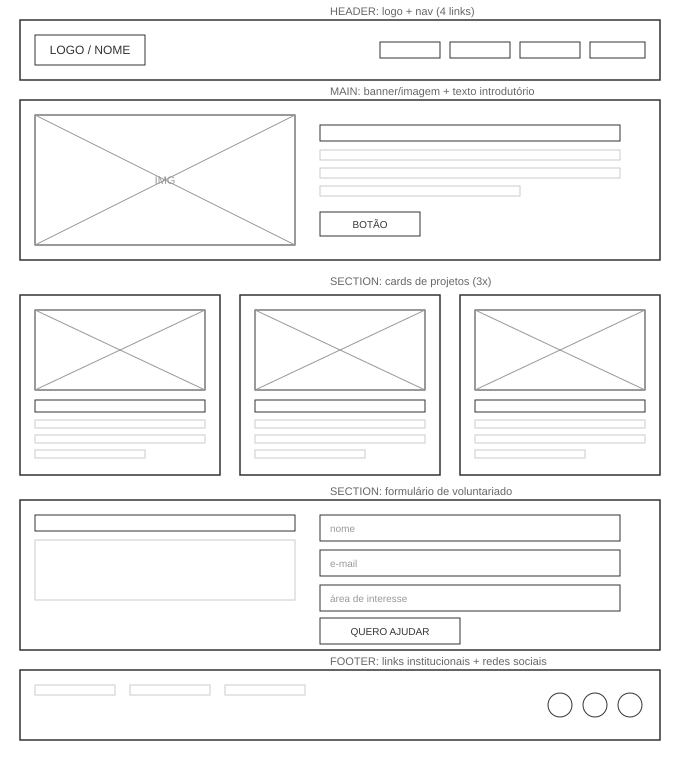
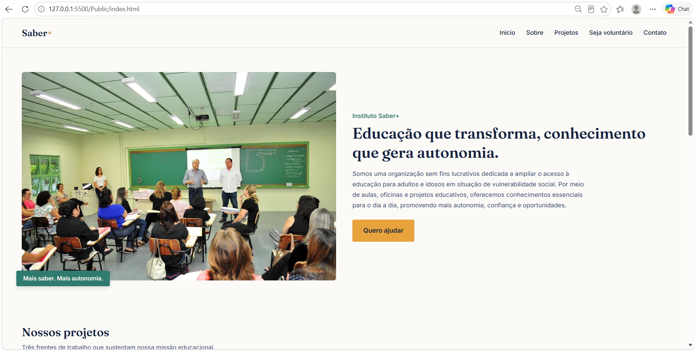
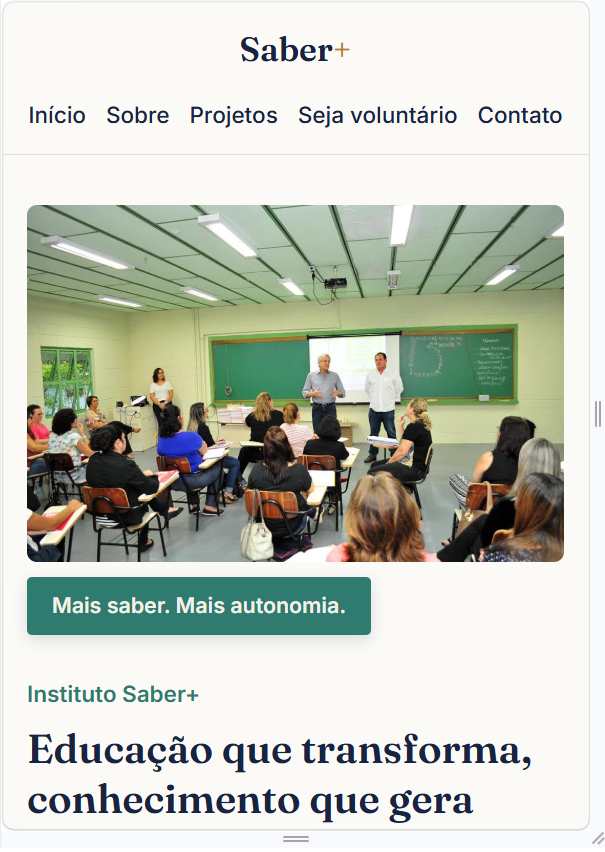

# Instituto Saber+

## Dados do aluno
- **Nome:** Anna Julia Magalhães
- **Matrícula:** 935744
- **Proposta escolhida:** 3 — Organizações e Equipes (Organização + Membros/Projetos/Setores)

## Sobre o projeto
O **Instituto Saber+** é uma organização sem fins lucrativos fictícia dedicada a
ampliar o acesso à educação e ao conhecimento para adultos e idosos em situação
de vulnerabilidade social. O site apresenta a organização e seus três principais
projetos — Inclusão Digital, Leitura e Comunicação, e Matemática e Vida
Financeira — além de um formulário para cadastro de novos voluntários.

## Esboço (wireframe)

## Print da home-page

## Tecnologias utilizadas
- HTML5 (tags semânticas: header, nav, main, section, article, footer)
- CSS3 (box-model, Flexbox, Grid, position)
- Imagens utilizadas do google imagens (capacitacao.jpg, digital.jpg, leitura.jpg, matematica.webp)

## Como executar
Abra o arquivo `public/index.html` no navegador, ou utilize a extensão
Live Server do VS Code para visualizar com recarregamento automático.
